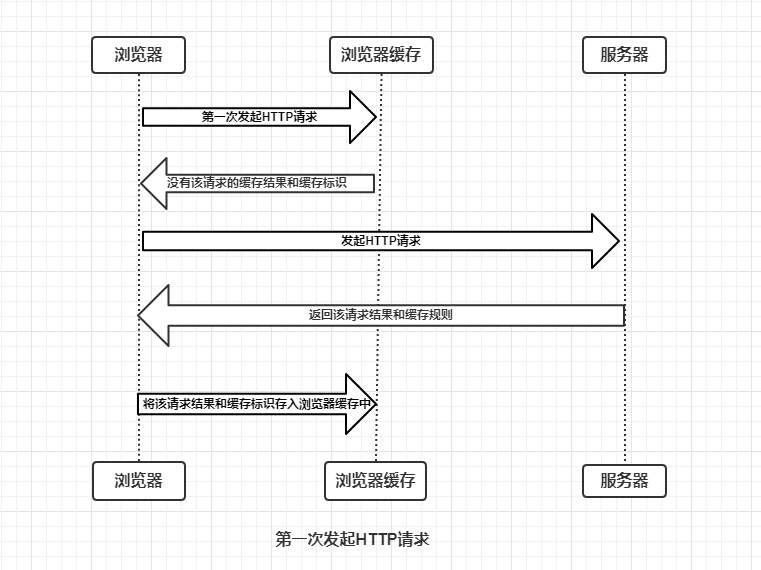

### 浏览器缓存相关内容

### 浏览器缓存原理

1. 客户端向服务端发起http请求，会去浏览器缓存中查找是否有该请求的缓存结果，如果找到了且没有过期，那么就直接从浏览器缓存中获取，不会再向服务端请求。这个过程称之为**强制缓存**，可以理解为按规则办事（缓存标识有没有过期），没有过期就直接取了。
2. 那么如果说强制缓存失效了（浏览器缓存中没找到对应的缓存结果或者说找到了但是缓存标识已经失效了）这里分别有两种情况
   1. 缓存中没有结果和标识，那么客户端就直接向服务器请求最新的，都不需要走协商了
   2. 有缓存结果但是已经失效了，这时候客户端带上缓存标识再向服务端请求，走协商缓存的路子。因为浏览器强制缓存失效不代表内容不可用，可能服务端的内容还是和当前缓存内容一样的，所以就需要靠服务端来判断该缓存内容是否还生效，如果生效的话返回304，资源无更新。
3. 如果协商缓存也生效了，那么就是重新请求，资源更新。返回200和最新结果
4. 缓存失效，客户端重新请求结果，再次存入浏览器缓存。

简言之，浏览器缓存机制先走强制缓存，浏览器判断缓存是否过期没过期直接用，过期了再带着缓存标识向服务端请求让服务端判断浏览器的缓存是否过期（协商过程）。

### 缓存的标识

如上所说的缓存标识，不管是浏览器还是客户端都是要根据http请求中的缓存的标识来作为判断依据。

#### 强制缓存规则

1. expires(http/1.0): 给返回结果在客户端设置一个缓存时间（绝对时间点 比如2024年10月1号 10:10:10），超过这个时间再去访问则过期失效，强制缓存失效。
2. Cache-control: http请求和响应中，通过指定指令来实现缓存机制。但要注意的是请求的指令并不一定包含在响应中，因为请求只是希望，但是服务端有自己的处理逻辑并不一定会满足客户端请求的对应设置。`cache-control: private, max-age=3600` 
   1. public/private 可以被任何对象缓存，
   1. no-cache：不走本地强制缓存验证，直接让服务端进行验证（协商缓存）
   1. no-store：不缓存任何响应内容，直接请求最新的内容
   1. max-age：返回一个过期时间max-age=3600，一小时后过期，这是一个相对时间，相比expires更加准确可靠，因为expires的时间可能因为时差的原因不够准确。

cache-control优先级更高

#### 协商缓存规则

1. Last-modified/if-Modified-Since，请求的响应会返回该资源文件最后一次被被修改的时间，如果强制缓存失效，客户端带上这个时间对应的参数是if-Modified-Since向服务端请求，服务端进行对比，如果服务端最新的修改时间>if-Modified-Since(Last-Modified)时间，就是说在返回给客户端之后资源文件做了修改，那么重新返回资源，状态码200；不然就返回304，资源无更新，继续用缓存文件。
2. ETag/if-None-Match，Etag是服务端给每个资源文件生成的唯一标识符，强制缓存失效后，客户端请求带上if-None-Match（上次Etag响应的数据），让浏览器对比是否匹配。优先级高于Last-modified

Etag是基于文件资源内容生成，所以更加精准，打个比方服务端的资源A，增加了一行代码后又删除了last-modified时间会发生变化，但是内容实际上是没有变化，如果last-modified判断的话就要重新发送文件，Etag判断的话该文件没有变化依旧能匹配上，所以继续采用浏览器本地缓存。Etag没有时钟不一致（客户端和服务端显示时间不一致可能因为时差、或者人为修改等）的问题

### 总结

浏览器缓存是先进行强制缓存，先找本地找到且生效那么直接用，不请求了；找到了但是本地判断是失效了，那么带上缓存标识向服务端请求让服务端判断协商是否可以继续用；如果本地找不到任何缓存信息，那么就直接请求了跳过缓存机制。

